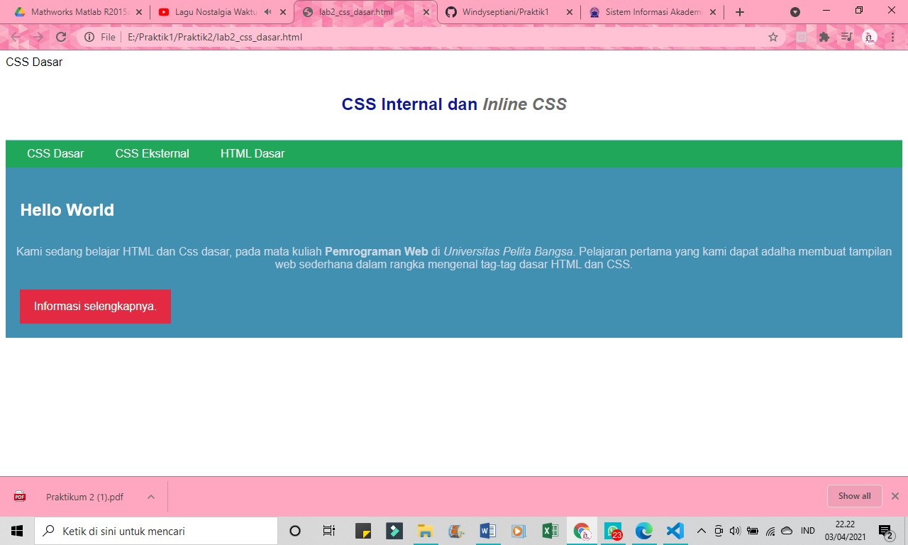

# Praktik2
## Belajar HTML dan CSS

##### Nama : Windy Septiani
##### NIM  : 311910673

### Menjawab Pertanyaan Tugas Praktik Kedua
##### 1 Lakukan eksperimen dengan mengubah dan menambah properti dan nilai pada kode CSS dengan mengacu pada CSS Cheat Sheet yang diberikan pada file terpisah dari modul ini.
jawaban :

##### 2 Apa perbedaan pendeklarasian CSS elemen h1 {...} dengan #intro h1 {...}? berikan penjelasannya!
Jawaban : Perbedaan antara id dan class adalah ID hanya bisa digunakan untuk satu objek saja, diawali dengan tanda pagar (#). Class adalah style dari CSS yang bisa digunakan untuk beberapa elemen, dengan adanya class ini memungkinkan anda untuk merubah beberapa objek pada html dengan settingan yang sama,

##### 3 Apabila ada deklarasi CSS secara internal, lalu ditambahkan CSS eksternal dan inline CSS pada elemen yang sama. Deklarasi manakah yang akan ditampilkan pada browser? Berikan penjelasan dan contohnya!
Jawaban : Semua deklarasi akan ditampilkan, karena saling melengkapi. berikut adalah contohnya :

##### 4 Pada sebuah elemen HTML terdapat ID dan Class, apabila masing-masing selector tersebut terdapat deklarasi CSS, maka deklarasi manakah yang akan ditampilkan pada browser? Berikan penjelasan dan contohnya! ( 
 )
Jawaban : Keduanya akan ditampilkan, karena Class merubah beberapa objek dengan settingan yang sama sehingga tidak merubah id. Contohnya :

## Praktik Belajar Membuat Dokumen HTML dan CSS
### Code sebelum deklarasi CSS

### Ini adalah gambar tampilan di broser

### Code setelah deklarasi CSS

### Ini adalah gambar tampilan di broser

### Code untuk menambahkan deklarasi inline CSS pada tag < p > 

### Ini adalah gambar tampilan di broser

### Code pembuatan CSS di dokumen baru

### Code untuk menambahkan tag < link > untuk merujuk file css yang sudah dibuat pada bagian < head >

### Ini adalah gambar tampilan di broser

### Code untuk menambahkan CSS Selector menggunakan ID dan Class Selector.

### Ini adalah gambar tampilan di broser
